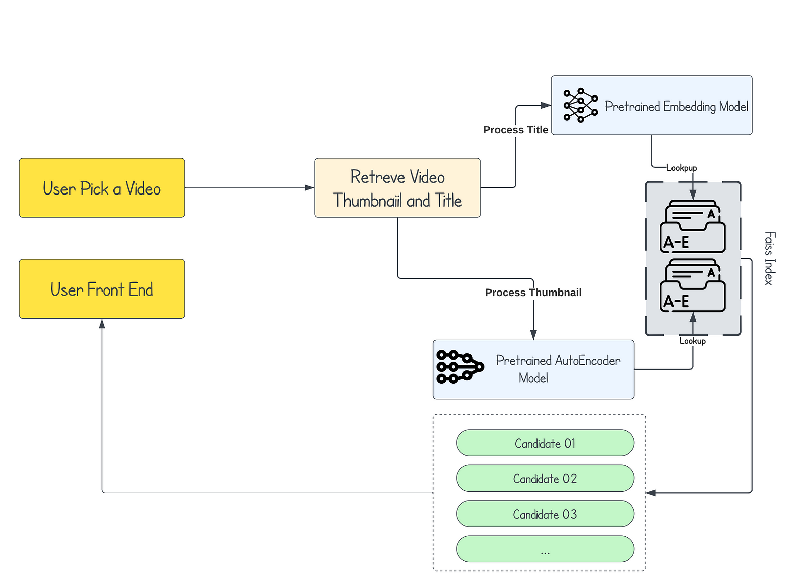

## Building YouTube Recommender System with Video Thumbnails and Titles

[Huggingface Space](https://huggingface.co/spaces/Ransaka/youtube-recommender)




This is hybrid recommender system with two methods,

- Using video thumbnails
- Using video titles

### Video Thumbnails

Used denoising autoencoder to learn latent patterns of the input images. Then used the encoder part of the network for feature compression. These compressed features are used to build a Faiss index for similarity search.

Network
 ```python
 class Encoder(nn.Module):
    def __init__(self, in_channels=1, out_channels=16, latent_dim=64, act_fn=nn.ReLU()):
        super().__init__()

        self.net = nn.Sequential(
            nn.Conv2d(in_channels, out_channels, 3, padding=1),  # (480, 360)
            act_fn,
            nn.Conv2d(out_channels, out_channels, 3, padding=1),
            act_fn,
            nn.Conv2d(out_channels, 2 * out_channels, 3, padding=1, stride=2),  # (240, 180)
            act_fn,
            nn.Conv2d(2 * out_channels, 2 * out_channels, 3, padding=1),
            act_fn,
            nn.Conv2d(2 * out_channels, 4 * out_channels, 3, padding=1, stride=2),  # (120, 90)
            act_fn,
            nn.Conv2d(4 * out_channels, 4 * out_channels, 3, padding=1),
            act_fn,
            nn.Flatten(),
            nn.Linear(4 * out_channels * 120 * 90, latent_dim),
            act_fn
        )

    def forward(self, x):
        x = x.view(-1, 1, 480, 360)
        output = self.net(x)
        return output


class Decoder(nn.Module):
    def __init__(self, in_channels=1, out_channels=16, latent_dim=64, act_fn=nn.ReLU()):
        super().__init__()

        self.out_channels = out_channels

        self.linear = nn.Sequential(
            nn.Linear(latent_dim, 4 * out_channels * 120 * 90),
            act_fn
        )

        self.conv = nn.Sequential(
            nn.ConvTranspose2d(4 * out_channels, 4 * out_channels, 3, padding=1),  # (120, 90)
            act_fn,
            nn.ConvTranspose2d(4 * out_channels, 2 * out_channels, 3, padding=1,
                               stride=2, output_padding=1),  # (240, 180)
            act_fn,
            nn.ConvTranspose2d(2 * out_channels, 2 * out_channels, 3, padding=1),
            act_fn,
            nn.ConvTranspose2d(2 * out_channels, out_channels, 3, padding=1,
                               stride=2, output_padding=1),  # (480, 360)
            act_fn,
            nn.ConvTranspose2d(out_channels, out_channels, 3, padding=1),
            act_fn,
            nn.ConvTranspose2d(out_channels, in_channels, 3, padding=1)
        )

    def forward(self, x):
        output = self.linear(x)
        output = output.view(-1, 4 * self.out_channels, 120, 90)
        output = self.conv(output)
        return output


class Autoencoder(nn.Module):
    def __init__(self, encoder, decoder):
        super().__init__()
        self.encoder = encoder
        self.encoder.to(device)

        self.decoder = decoder
        self.decoder.to(device)

    def forward(self, x):
        encoded = self.encoder(x)
        decoded = self.decoder(encoded)
        return decoded

 ```


### Video titles

Title embedding extracted using `intfloat/multilingual-e5-base` model. Input data contains Sinhala, English, tamil and few other. Hence chosen model is multilinglual.

```python
model = SentenceTransformer('intfloat/multilingual-e5-base')
input_texts = dataset['train']['title'] + dataset['test']['title']
embeddings = model.encode(input_texts, normalize_embeddings=True)
```

